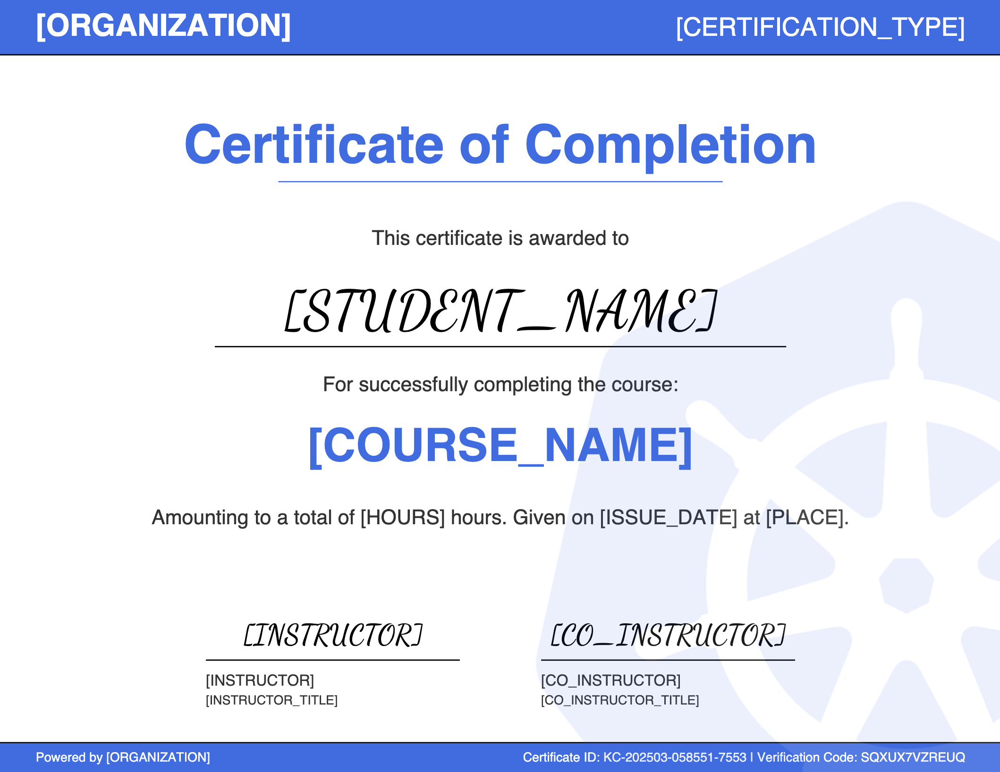

# Certificate Provider

A simple API service that allows training providers to create and validate the authenticity of digital certificates. This system enables certificate generation while also ensuring the certificates can be easily verified through a simple API call.

Certificate example:


Run the project with:
```bash
docker compose up --build
```

## API Endpoints

### Base URL

When running locally: `http://localhost:8000`

### Certificate Validation

The API supports both GET and POST methods for certificate validation.

#### GET Method

```
GET /validate?certificate_id=K8S-202503-A1B2C3-D4E5&verification_code=ABCDEF123456
```

Parameters:
- `certificate_id` (required): The certificate ID to validate
- `verification_code` (optional): Verification code for additional validation

#### POST Method

```
POST /validate
```

Request body:
```json
{
  "certificate_id": "K8S-202503-A1B2C3-D4E5",
  "verification_code": "ABCDEF123456"
}
```

### Response Format

For successful validation:
```json
{
  "valid": true,
  "certificate_data": {
    "id": "K8S-202503-A1B2C3-D4E5",
    "student_name": "John Doe",
    "course_name": "Kubernetes Administration",
    "issue_date": "05 March, 2025"
  }
}
```

For failed validation:
```json
{
  "valid": false,
  "message": "Certificate not found"
}
```

## Example API Usage

### Using cURL

```bash
# Validate with GET
curl "http://localhost:8000/validate?certificate_id=K8S-202503-A1B2C3-D4E5&verification_code=ABCDEF123456"

# Validate with POST
curl -X POST "http://localhost:8000/validate" \
  -H "Content-Type: application/json" \
  -d '{"certificate_id":"K8S-202503-A1B2C3-D4E5","verification_code":"ABCDEF123456"}'
```